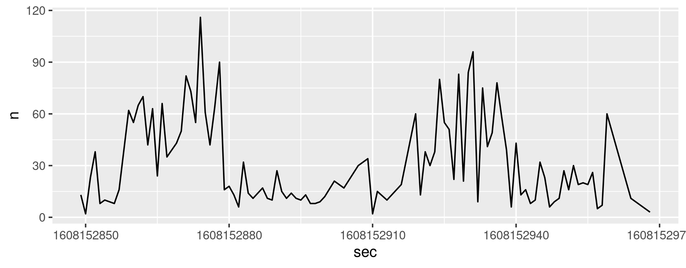

`traffic`: A simple command-line tool that reads and writes lines at
configurable rates.

If you have [Go](https://golang.org/) installed:

```Shell
go get github.com/morphism/traffic/...
```

For testing and demos, `traffic` can run in a mode that just emits
lines to `stdout`:

```Shell
traffic -test-source | head -5
```

Output:

```
000000000 2020-12-16T20:26:51.531243391Z
000000001 2020-12-16T20:26:51.531263127Z
000000002 2020-12-16T20:26:51.531265962Z
000000003 2020-12-16T20:26:51.531267922Z
000000004 2020-12-16T20:26:51.531269669Z
```

That kind of output makes for good input for real `traffic` use:

```Shell
traffic -test-source | traffic -config demo
```

The second `traffic` will emit lines from its `stdin` at highly
configurable, variable rates based on a configuration.  This
configuration specifies a set of probability distributions and
associated effective time ranges.  Thanks to
[`gonum.org`](https://gonum.org/), a wide range of [probability
distributions](https://godoc.org/gonum.org/v1/gonum/stat/distuv) is
available.

At every tick (every second by default), `traffic` finds the active
distributions and samples counts of lines to forward during that tick.
This behavior enables piping input at realistic and interesting rates.

The `-config FILENAME` option should given a filename contain either
JSON or YAML that represents a configuration.  For now, see the [Go
documentation]() to see how to provide a configuration.

Note pipes will typically involve buffering.  Consult some
[suggestions](https://unix.stackexchange.com/questions/25372/turn-off-buffering-in-pipe)
about how to disable buffering if that's what you want.


