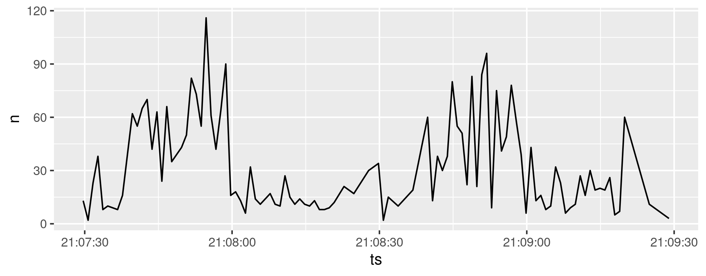

`traffic`: A simple command-line tool that reads and writes lines at
configurable rates.

If you have [Go](https://golang.org/) installed:

```Shell
go get github.com/morphism/traffic/...
```

Alternately you might find a
[release](https://github.com/morphism/traffic/releases) that's
suitable.

## Usage

```
Usage of traffic:
  -config string
    	Name of configuration file (default "traffic.json")
  -interval duration
    	Tick duration (default 1s)
  -limit uint
    	Number of ticks (0 means run forever)
  -log
    	Turn on some logging output
  -seed uint
    	Seed for the RNG (defaults to current time in nanoseconds)
  -test-source
    	Just run a test input source
  -timestamps
    	Prefix each line with current timestamp
  -warn duration
    	Log warning if lagging for more than this duration (default 1s)
```

`traffic` emits lines from its `stdin` at configurable, variable rates
based on a configuration.  This configuration specifies a set of
probability distributions and associated effective time ranges.
Thanks to [`gonum.org`](https://gonum.org/), a wide range of
[probability
distributions](https://godoc.org/gonum.org/v1/gonum/stat/distuv) is
available.

See [traffic.json](traffic.json) for an example configuration.

At every tick (every second by default), `traffic` finds the active
distributions and samples counts of lines to forward during that tick.
This behavior enables piping input at realistic and interesting rates.

The `-config FILENAME` option should given a filename contain either
JSON or YAML that represents a configuration.  For now, see the [Go
documentation](https://godoc.org/github.com/morphism/traffic) to see
how to provide a configuration.

Note that pipes will typically involve buffering.  Consult some
[suggestions](https://unix.stackexchange.com/questions/25372/turn-off-buffering-in-pipe)
about how to disable buffering if that's what you want.


## Examples

For testing and demos, `traffic` can run in a mode that simply emits
lines to `stdout` (and does not read from `stdin`):

```Shell
traffic -test-source | head -5
```

Output:

```
000000000 2020-12-16T20:26:51.531243391Z
000000001 2020-12-16T20:26:51.531263127Z
000000002 2020-12-16T20:26:51.531265962Z
000000003 2020-12-16T20:26:51.531267922Z
000000004 2020-12-16T20:26:51.531269669Z
```

That kind of output makes for good input for real `traffic` use:

```Shell
traffic -test-source | traffic -config traffic.json -log
```


